# DialysisGuard: AI-Driven Real-Time Monitoring System

## Overview

**DialysisGuard** is an AI-driven real-time monitoring and adverse event prediction system for hemodialysis. The system uses a GRU (Gated Recurrent Unit) deep learning model trained on temporal physiological data to predict patient instability during dialysis sessions.

The system features:
- A GRU model **trained on `synthetic_hemodialysis_timeseries.csv`** (5000 patients × 30 time steps)
- **Explainable AI (XAI)** — 7 techniques making every prediction transparent and actionable
- A **FastAPI** backend with REST APIs and WebSocket support
- A MongoDB database for persistent storage
- A **physiologically realistic simulation engine** that generates random but clinically plausible vital trajectories
- A Next.js frontend with dark theme, role-based dashboards, real-time monitoring, XAI, and alerts
- **8 innovative features** pushing beyond standard monitoring (predictive forecasting, smart escalation, anomaly detection, etc.)

---

## Project Architecture & Components

### Component 1: Project Structure

```text
.
├── final.ipynb                          # Reference notebook
├── Hemodialysis_Data 2.csv              # Original dataset (reference)
├── synthetic_hemodialysis_timeseries.csv # Training dataset
├── backend/
│   ├── main.py                          # FastAPI app entry point
│   ├── config.py                        # Configuration
│   ├── requirements.txt                 # Python dependencies
│   ├── database.py                      # MongoDB connection
│   ├── models/
│   │   ├── schemas.py                   # Pydantic models
│   │   └── db_models.py                 # MongoDB document schemas
│   ├── routes/
│   │   ├── auth.py                      # Login/register
│   │   ├── patients.py                  # Patient CRUD
│   │   ├── sessions.py                  # Session management
│   │   ├── predictions.py               # Model predictions
│   │   ├── alerts.py                    # Alert endpoints
│   │   └── explanations.py              # XAI endpoints
│   ├── services/
│   │   ├── ml_service.py                # GRU model inference + MC Dropout
│   │   ├── xai_service.py               # Explainable AI service
│   │   ├── simulation_service.py        # Physiological simulation engine
│   │   └── alert_service.py             # Alert + escalation logic
│   ├── ml/
│   │   ├── train_model.py               # Model training script
│   │   ├── attention_gru.py             # Attention-augmented GRU architecture
│   │   ├── gru_model.h5                 # Trained model (legacy format)
│   │   ├── gru_model.keras              # Trained model (Keras v3 format)
│   │   ├── best_weights.weights.h5      # Training checkpoint weights
│   │   ├── scaler.pkl                   # Fitted scaler
│   │   ├── label_encoders.pkl           # Label encoders
│   │   ├── feature_config.json          # Feature names/ranges
│   │   └── model_card.json              # Model transparency card
│   └── websocket/
│       └── realtime.py                  # WebSocket for real-time streaming
└── frontend/
    ├── package.json
    ├── next.config.mjs
    ├── src/
    │   ├── app/
    │   │   ├── layout.js / globals.css  # Dark theme
    │   │   ├── login/ & register/       # Auth pages
    │   │   ├── dashboard/
    │   │   │   ├── doctor/page.js       # Doctor dashboard
    │   │   │   ├── caregiver/page.js    # Caregiver dashboard
    │   │   │   └── command/page.js      # Multi-patient command center
    │   │   ├── patients/page.js         # Patient management (consolidated)
    │   │   ├── monitor/page.js          # Real-time monitoring & XAI dashboard (consolidated)
    │   │   ├── alerts/page.js           # Alerts dashboard
    │   │   └── model-info/page.js       # Model transparency
    │   └── components/
    │       ├── ErrorBoundary.js         # Error handling wrapper
    │       ├── PageShell.js             # Shared page container
    │       ├── Sidebar.js               # Navigation menu
    │       └── ui/
    │           └── HypnoRing.js         # Custom loading animation
```

---

### Component 2: ML Model Training

**Training Data**: `synthetic_hemodialysis_timeseries.csv` — 5000 patients, 30 time steps each at 8-min intervals

**Feature Processing**:
- **Static features** (constant per patient): Age, Gender, Weight, Diabetes, Hypertension, Kidney Failure Cause, Creatinine, Urea, Potassium, Hemoglobin, Hematocrit, Albumin, Dialysis Duration, Dialysis Frequency, Dialysate Composition, Vascular Access Type, Dialyzer Type, Urine Output, Dry Weight, Fluid Removal Rate, Disease Severity
- **Temporal features** (varying per time step): Current_BP, Current_HR, Time_Minutes
- **Engineered features**: BP rate-of-change, HR rate-of-change, BP deviation from baseline, cumulative BP volatility
- **Target**: `Is_Unstable` (binary, per time step)
- Categoricals encoded with LabelEncoder, numericals scaled with StandardScaler.
- Reshaped into sequences: each patient = 1 sequence of 30 time steps × N features
- Train/val/test split by Patient_ID (70/15/15) to prevent data leakage

**Model**: Attention-Augmented GRU (`backend/ml/attention_gru.py`)
```text
Input (30 × N_features) →
GRU(128, return_sequences=True) → BatchNorm →
GRU(64, return_sequences=True) → BatchNorm →
★ Bahdanau Attention Layer ★ →
GRU(32) → BatchNorm →
Dense(64, relu) → Dropout(0.3) →
Dense(32, relu) → Dropout(0.2) →
Dense(1, sigmoid)
```

**Outputs saved locally**:
- `gru_model.h5` — trained model
- `scaler.pkl` — fitted StandardScaler
- `label_encoders.pkl` — fitted LabelEncoders
- `feature_config.json` — feature names, types, and clinical ranges
- `model_card.json` — performance metrics, subgroup analysis

**Inference (`backend/services/ml_service.py`)**:
- Loads saved model/scaler/encoders at FastAPI startup
- `predict(sequence)` → risk probability
- `predict_with_uncertainty(sequence, n=20)` → MC Dropout confidence interval
- `get_attention_weights(sequence)` → temporal attention from the attention layer

---

### Component 3: Physiological Simulation Engine

**Implementation**: `backend/services/simulation_service.py`

Since the training CSV is static, the simulation generates **fresh, never-seen data** for active monitoring:

**How it works**:
1. **Patient baseline** → from the patient's stored demographics/clinical data
2. **Vital trajectory generation** using clinical models:

```python
class PhysiologicalSimulator:
    """Generates realistic dialysis session vital trajectories"""
    
    def generate_session(self, patient_data, risk_profile="moderate"):
        """
        Generates 30 time steps (0-232 min) of vitals:
        
        Blood Pressure Model:
        - Starts at patient's pre-dialysis BP
        - Natural drift downward during dialysis (fluid removal effect)
        - Random Gaussian noise (±5-10 mmHg per step)
        - If risk_profile="high": steeper drop + potential crash events
        - Bounded by physiological limits (60-200 mmHg)
        
        Heart Rate Model:
        - Starts at patient's baseline HR
        - Compensatory increase as BP drops (baroreceptor reflex)
        - Random noise (±3-5 bpm)
        - Tachycardia events in high-risk profiles
        - Bounded (40-150 bpm)
        
        Other vitals follow similar clinical patterns.
        """
```

3. **Risk profiles**: Random selection with weights — `low`(40%), `moderate`(35%), `high`(20%), `critical`(5%)
4. **Deterioration events**: Randomly injected BP crashes, tachycardia spikes, or gradual decline patterns
5. Each generated time step is immediately fed to the GRU model → real-time prediction

**Why this is better than replaying CSV data**:
- Every simulation is unique — unpredictable for the user
- Tests the model on genuinely unseen patterns
- Clinically realistic — based on actual dialysis physiology
- Controllable — can seed specific risk scenarios for training/demo

---

### Component 4: FastAPI Backend

**Implementation**: `backend/main.py`
- FastAPI app with CORS, JWT auth middleware
- Auto-generated OpenAPI docs at `/docs`
- Lifespan handler to load ML model at startup
- WebSocket endpoint for real-time streaming
- All routes registered as APIRouters

#### API Endpoints

**Auth** (`/api/auth/`)
| Endpoint | Method | Description |
|---|---|---|
| `register` | POST | Register user (doctor/caregiver) |
| `login` | POST | Login → JWT token |
| `me` | GET | Current user profile |

**Patients** (`/api/patients/`)
| Endpoint | Method | Description |
|---|---|---|
| `/` | GET | List patients (search, filter, sort) |
| `/` | POST | Create patient |
| `/{id}` | GET/PUT/DELETE | Patient CRUD |

**Sessions** (`/api/sessions/`)
| Endpoint | Method | Description |
|---|---|---|
| `/` | POST | Start session (triggers simulation) |
| `/{id}` | GET | Session details + time-series |
| `/{id}/stop` | POST | Stop session |
| `/{id}/report` | GET | Auto-generated session report |
| `/patient/{patient_id}` | GET | Patient's session history |

**Predictions** (`/api/predict/`)
| Endpoint | Method | Description |
|---|---|---|
| `/` | POST | Single prediction |
| `/risk-assessment` | POST | Full assessment with recommendations |

**Alerts** (`/api/alerts/`)
| Endpoint | Method | Description |
|---|---|---|
| `/` | GET | List alerts (filters: severity, acknowledged, date) |
| `/{id}/acknowledge` | POST | Acknowledge alert |
| `/stats` | GET | Alert statistics |

**Explanations** (`/api/explain/`)
| Endpoint | Method | Description |
|---|---|---|
| `/shap` | POST | SHAP feature attributions |
| `/attention` | POST | Temporal attention weights |
| `/what-if` | POST | Re-predict with modified params |
| `/counterfactual` | POST | Find minimal changes for target risk |
| `/sensitivity` | POST | Parameter sensitivity analysis |
| `/model-card` | GET | Model transparency info |

---

### Component 5: WebSocket Real-Time Streaming

**Implementation**: `backend/websocket/realtime.py`
- FastAPI WebSocket endpoint at `/ws/monitor/{session_id}`
- On connect: simulation engine begins generating vital data
- **Every 2-3 seconds** emits a JSON payload:

```json
{
  "time_minutes": 48,
  "vitals": {"bp": 118.5, "hr": 82.3, "weight": 96.8},
  "prediction": {
    "risk_probability": 0.72,
    "risk_level": "HIGH",
    "confidence": {"mean": 0.72, "lower": 0.64, "upper": 0.80}
  },
  "xai": {
    "top_features": [
      {"name": "BP Drop", "contribution": 0.18, "direction": "risk_increasing"},
      {"name": "Fluid Rate", "contribution": 0.12, "direction": "risk_increasing"}
    ],
    "attention_weights": [0.02, 0.03, 0.04, 0.05, 0.08, 0.12],
    "nl_explanation": "Risk is HIGH primarily due to significant blood pressure drop...",
    "risk_trend": "increasing",
    "risk_forecast_5step": [0.72, 0.75, 0.78, 0.81, 0.84]
  },
  "anomalies": [
    {"feature": "Current_BP", "type": "rapid_decline", "severity": "warning"}
  ],
  "alert": null
}
```

- Simulation stops on disconnect or explicit stop event

---

### Component 6: Frontend — Next.js Application

#### Theme & Design
- Dark theme: navy/charcoal (`#0a0e17`, `#111827`), cyan accents (`#06b6d4`), red alerts (`#ef4444`)
- Google Font: Inter
- Glassmorphism cards, micro-animations, smooth transitions

#### Pages

**Login/Register** — Animated medical-themed gradient backgrounds, JWT auth

**Doctor Dashboard** — Stats overview, active sessions grid with mini risk gauges, recent alerts, patient quick-access, risk distribution chart

**Caregiver Dashboard** — Simplified: large vital displays, prominent alerts, quick actions

**Patient Management** — Searchable list, comprehensive entry form, full patient profile

**Real-Time Monitoring & Explainability Dashboard** (`/monitor`):
- Live vital sign charts (BP, HR updating in real-time)
- Risk Gauge with Confidence Band (e.g., "72% ± 6%")
- **Risk Trend Arrow** — ↑ increasing, → stable, ↓ decreasing
- **Risk Forecast Mini-Chart** — predicted risk for next 5 time steps
- SHAP mini-panel (top 5 contributing features, live)
- **Anomaly Markers** — flashing indicators on vital charts when anomaly detected
- Natural language explanation panel
- **Audio alert** — browser notification sound on CRITICAL risk
- Alert banner with explanation of WHY
- **Integrated XAI Panels**: Includes SHAP Waterfall charts, What-If Simulator + Counterfactual suggestions, Temporal Attention Heatmap, and MC Dropout Confidence Distribution embedded directly in the monitoring session.

**Session History & Comparison**:
- Currently consolidated into patient profile/monitoring views.
- Trend analysis across past sessions for specific patients.

**Multi-Patient Command Center** (`/dashboard/command`):
- Grid view of ALL active sessions simultaneously
- Each cell: patient name, mini vital chart, risk gauge, alert status
- Click any cell to drill into full monitoring view
- Auto-sorts by risk level (highest risk at top)

**Model Info** — Full model card display

---

### Component 7: Explainable AI (XAI) — 7 Pillars

```mermaid
graph TD
    A["Prediction: 78% Risk"] --> B["🔍 WHY? — SHAP"]
    A --> C["⏱️ WHEN? — Attention"]
    A --> D["🔄 WHAT IF? — Counterfactual"]
    A --> E["📊 HOW SURE? — MC Dropout"]
    A --> F["💬 EXPLAIN — Natural Language"]
    A --> G["🗺️ OVER TIME — Temporal Heatmap"]
    A --> H["📋 TRUST — Model Card"]
```



**Pillar 1: SHAP** — Per-prediction feature contributions via `shap.DeepExplainer`. Waterfall charts show base → final prediction.

**Pillar 2: Attention GRU** — Custom Bahdanau attention layer in the GRU outputs temporal weights showing which time steps mattered. Visualized as heatmaps.

**Pillar 3: What-If / Counterfactual** — Interactive sliders modify parameters → instant re-prediction. Auto-finds minimal changes to reach target risk. Sensitivity spider chart.

**Pillar 4: MC Dropout** — 20 forward passes with dropout active → mean, std, 95% CI. Wide interval = low confidence → special "Uncertain" flag.

**Pillar 5: Natural Language** — Template-based sentences combining SHAP top features + attention temporal focus + clinical context. Adapts to risk level.

**Pillar 6: Temporal Heatmap** — 2D matrix [time × features] with SHAP values. Shows how feature contributions evolve across the session.

**Pillar 7: Model Card** — Architecture, performance metrics, subgroup fairness, limitations, ethical notes.

---

### Component 8: Innovative Features 🚀

#### 1. Predictive Risk Forecasting
- At each time step, model predicts risk for the NEXT 5 time steps (40 minutes ahead)
- Uses the simulation engine to project vital trajectories forward
- Frontend shows a "forecast cone" — expanding uncertainty over future steps
- **Clinical value**: "At current trends, risk will reach CRITICAL in ~24 minutes"

#### 2. Smart Alert Escalation
- Alerts that AUTO-ESCALATE if not acknowledged within a time window:
  - MODERATE → 5 min → re-alert as HIGH
  - HIGH → 3 min → re-alert as CRITICAL
  - CRITICAL → 1 min → escalate to ALL connected users
- Visual escalation: alert card pulses faster, border thickens
- **Tracks response times** for quality metrics

#### 3. Session Comparison Analytics
- Compare current session vs. same patient's past sessions
- Overlay risk curves, vital trajectories, and alert timings
- Identify patterns: "This patient typically becomes unstable around minute 160"
- **Clinical value**: Personalized risk thresholds based on patient history

#### 4. Multi-Patient Command Center
- Real-time grid view of ALL active sessions
- Auto-sorted: highest risk patients at top-left
- Color-coded borders: green (low), yellow (moderate), red (high), pulsing red (critical)
- One-click drill-down to full monitoring view
- **Clinical value**: Nurse stations monitoring multiple patients simultaneously

#### 5. Auto Session Report
- At session end, auto-generates a comprehensive report:
  - Session timeline with vital charts and risk curves
  - All alerts triggered (with explanations)
  - Peak risk moments with XAI breakdown
  - Interventions timeline
  - Model confidence throughout session
- Downloadable as JSON (future: PDF)

#### 6. Anomaly Detection Highlighting
- Separate from GRU prediction — statistical anomaly detection on vital signs
- Z-score based: flags values > 2σ from patient's session mean
- Rate-of-change detection: flags sudden jumps (e.g., BP drops > 15 mmHg in one step)
- **Visual**: flashing orange marker on the vital chart at anomaly points
- **Clinical value**: Catches sudden changes even before the GRU model risk catches up

#### 7. Audio/Visual Critical Alerts
- Browser audio notification on CRITICAL risk events
- Screen flash effect (brief red pulse on page border)
- Persistent alert banner that cannot be dismissed without acknowledgment
- **Clinical value**: Ensures critical events are never missed, even if clinician isn't looking at screen

#### 8. Risk Trend Indicators
- Real-time trend calculation over last 5 predictions:
  - ↑ INCREASING (risk rising > 5% over last 5 steps)
  - → STABLE (risk fluctuating within ±5%)
  - ↓ DECREASING (risk falling > 5%)
- Displayed as animated arrow next to Risk Gauge
- Color-coded: red arrow up, green arrow down, gray arrow right
- **Clinical value**: Quick visual indicator of trajectory direction

---

### Component 9: Database — MongoDB Schema


---

## Data Flow

```mermaid
sequenceDiagram
    participant U as Frontend
    participant API as FastAPI
    participant WS as WebSocket
    participant SIM as Simulation Engine
    participant ML as GRU Model
    participant XAI as XAI Service
    participant DB as MongoDB

    U->>API: Login → JWT
    U->>API: Create Patient
    U->>WS: Start Simulation

    WS->>SIM: Generate vital trajectory (patient baseline + risk profile)
    WS->>DB: Create Session

    loop Every 2-3 seconds (30 time steps)
        SIM-->>WS: Generated vital signs for this step
        WS->>ML: Predict on accumulated window (MC Dropout × 20)
        ML-->>WS: Risk prob + confidence interval
        WS->>XAI: SHAP + attention + NL explanation
        XAI-->>WS: XAI bundle
        WS->>WS: Anomaly detection on vitals
        WS->>WS: Risk trend calculation
        WS->>WS: Risk forecast (next 5 steps)
        WS->>U: Full payload (vitals + prediction + XAI + anomalies + trend + forecast)
        alt Risk > threshold
            WS->>DB: Store Alert with XAI
            WS->>U: Alert with explanation
        end
        alt Unacknowledged alert timeout
            WS->>U: Escalated Alert
        end
    end

    U->>WS: Stop Simulation
    WS->>DB: Save session + auto-generate report
    WS-->>U: Session Summary
```



---

## Testing & Validation

### Automated Tests
```bash
# Backend
cd backend
pip install -r requirements.txt
pytest tests/ -v
```
- Auth (register, login, token)
- Patient CRUD
- Prediction + risk assessment
- Simulation engine generates plausible vitals (within clinical ranges)
- SHAP returns correct dimensions, base + contributions ≈ prediction
- Attention weights sum to ~1.0
- MC Dropout produces variance across passes
- What-If correctly reflects parameter modifications
- Counterfactual suggestions within clinical ranges
- Anomaly detection flags known outliers
- Alert escalation fires after timeout

### Model Validation
```bash
python backend/ml/train_model.py --validate
```
- Accuracy ≥ 85%, AUC ≥ 0.8
- Saved model loads and predicts
- Attention layer outputs valid weights

### Frontend Initialization
```bash
cd frontend
npm run build
npm start
```

### Manual Testing Runbook
1. **Login/register flow**: Authenticate via JWT.
2. **Patient entry**: Create test patients with varied clinical fields.
3. **Start simulation**: Verify unique vital trajectories generate per run.
4. **Real-time updates**: Ensure risk gauge, confidence band, trend arrow, and forecast update correctly.
5. **XAI Integration**: Verify SHAP panel, NL explanation, and anomaly markers react dynamically.
6. **Critical pathways**: Confirm audio alert sounds on CRITICAL events.
7. **Simulation constraints**: Wait for timeout and observe alert escalation.
8. **Explainability Dashboard**: Open the full dashboard, test What-If sliders, and generate counterfactuals.
9. **Session comparison**: Run 2 separate sessions for the same patient and compare results side-by-side.
10. **Command Center**: Open the multi-patient command center, start 3+ sessions, verify priority grid sorting.
11. **Report Generation**: Stop a session and verify auto-generated endpoint report payloads.
12. **Roles**: Test difference between restricted `caregiver` and full `doctor` access.
